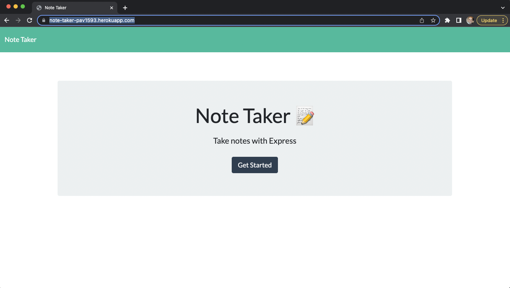
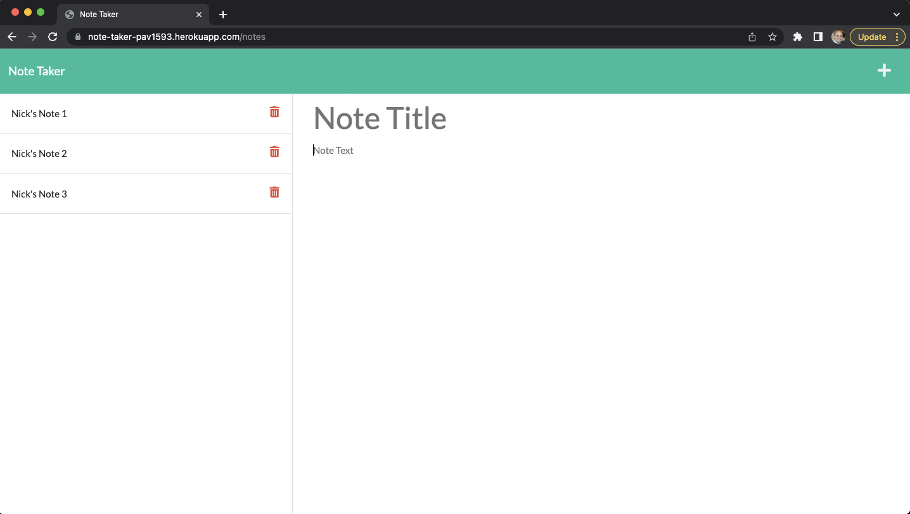
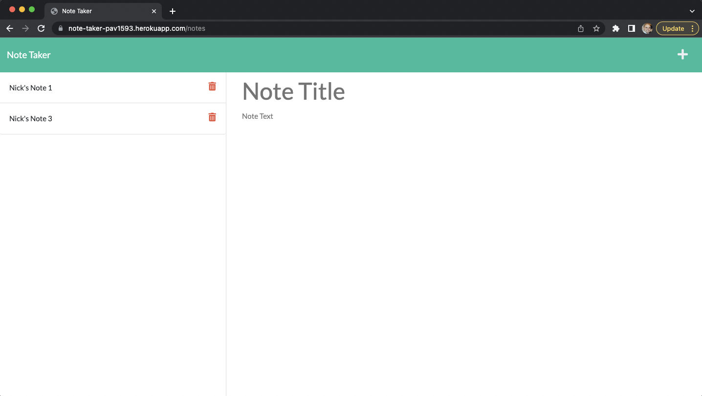
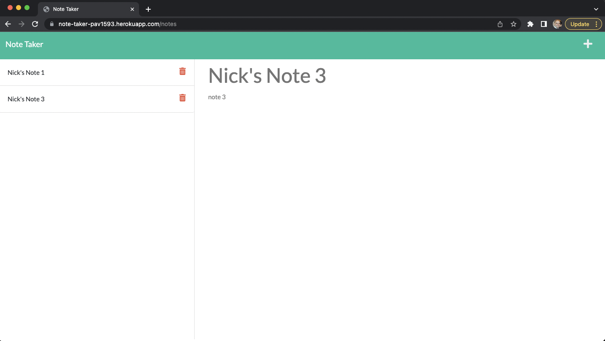

# Note Taker

## Description
---

 Web application that can be used to write, delete and save notes. 

## Usage
---
1.  Open the Note Taker by clicking on the link to the notes page  

2. Existing notes are listed in the left-hand column, plus empty fields to enter a new note title and the note’s text in the right-hand column.

3. When you enter a new note title and the note’s text, a Save icon appears in the navigation at the top of the page and when clicked the new note is saved and appears in the left-hand column with the other existing notes.

4. When you click on an existing note in the list in the left-hand column that note appears in the right-hand column.

5. When you click on the Write icon in the navigation at the top of the page you are presented with empty fields to enter a new note title and the note’s text in the right-hand column.

6. When you click on the Delete icon next to a existing note in the left-hand column then that note is deleted.


## Technologies
---
This application uses Node.js, Express.js back and is deployed using Heroku.


## Design Requirements  
---

### User Story

```
AS A small business owner
I WANT to be able to write and save notes
SO THAT I can organize my thoughts and keep track of tasks I need to complete
```

### Acceptance Criteria   

```
GIVEN a note-taking application
WHEN I open the Note Taker
THEN I am presented with a landing page with a link to a notes page
WHEN I click on the link to the notes page
THEN I am presented with a page with existing notes listed in the left-hand column, plus empty fields to enter a new note title and the note’s text in the right-hand column
WHEN I enter a new note title and the note’s text
THEN a Save icon appears in the navigation at the top of the page
WHEN I click on the Save icon
THEN the new note I have entered is saved and appears in the left-hand column with the other existing notes
WHEN I click on an existing note in the list in the left-hand column
THEN that note appears in the right-hand column
WHEN I click on the Write icon in the navigation at the top of the page
THEN I am presented with empty fields to enter a new note title and the note’s text in the right-hand column
```

### Mock-Up

The following images show the web application's appearance and functionality:


## Screenshots
---

1. Landing page:  

  

2. Exiting courses displayed:  

  

3. Deleted Note 2:  

  

4. Display Note 3:  

  

## Deployment
---

* URL: https://note-taker-pav1593.herokuapp.com/

* Github: https://github.com/pav1593/Note-Taker

